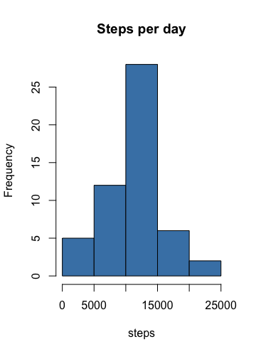

----------------------------
 "PA1_Template.Rmd"
----------------------------

```{r setup, include=FALSE}
knitr::opts_chunk$set(echo = TRUE, results = "asis")
```

## R Markdown

This R Markdown document describe and develop the code and the steps taken to accompished all task involves in Project 1 - Reproducible Research Course. The code will be shown the same that the output.

When you click the **Knit** button a document will be generated that includes both content as well as the output of any embedded R code chunks within the document. You can embed an R code chunk like this:

```{r load pacakge, echo=FALSE}
#Load Package 
library(lubridate)
library(data.table)
library(ggplot2)
```

```{r load data}
#Load data
Urlfile <- "https://d396qusza40orc.cloudfront.net/repdata%2Fdata%2Factivity.zip"
download.file(Urlfile, destfile = "./Activity_data.zip")
unzip("Activity_data.zip")
Activity_data <- read.csv("activity.csv")
```

## First Part.
Once we loaded the dat we are going to develop the following points:  


1.Calculate the total number of steps taken per day
2. Make a histogram of the total number of steps taken each day
3.Calculate and report the mean and median of the total number of steps taken per day


```{r steps_per_day}
steps_per_day <- aggregate(steps ~ date, Activity_data, sum)
str(steps_per_day)
hist_1 <- hist(steps_per_day$steps, main="Steps per day", xlab= "steps", 
               col="steelblue", breaks = 50, border="black" )
mean_per_day <- mean(steps_per_day$steps)
print(mean_per_day)
median_per_day <- median(steps_per_day$steps)
print(median_per_day)
```
 


## Second Part - 

1.Make a time series plot  of the 5-minute interval (x-axis) and the average number of steps taken, averaged across all days (y-axis)
2.Which 5-minute interval, on average across all the days in the dataset, contains the maximum number of steps?

```{r steps_interval_mean}
steps_per_interval_mean <- aggregate(steps ~interval, Activity_data, mean)
plot(steps_per_interval_mean$interval, steps_per_interval_mean$steps, 
     main ="Mean steps per interval", xlab="interval", ylab="mean_steps",
     type = "l", col="darkblue")
#Max mean_steps per intevarl
max(steps_per_interval_mean$steps)
which.max(steps_per_interval_mean$step) 
```

 


### Imputing missing values


Note that there are a number of days/intervals where there are missing values . The presence of missing days may introduce bias into some calculations or summaries of the data.

1.Calculate and report the total number of missing values in the dataset.
2.Devise a strategy for filling in all of the missing values in the dataset. The strategy does not need to be sophisticated. For example, you could use the mean/median for that day, or the mean for that 5-minute interval, etc.
3.Create a new dataset that is equal to the original dataset but with the missing data filled in.
4.Make a histogram of the total number of steps taken each day and Calculate and report the mean and median total number of steps taken per day. Do these values differ from the estimates from the first part of the assignment? What is the impact of imputing missing data on the estimates of the total daily number of steps?

### Treatment of NA values.


```{r missing values}
#Mangging Missing values . 
Missing_values <- Activity_data[!complete.cases(Activity_data),]
nrow(Missing_values)
```

### AVG INTERVAL
````{r average por interval}
for (i in 1:nrow(Activity_data)) {
        if(is.na(Activity_data$steps[i])) {
                val <- steps_per_interval_mean$steps[which(steps_per_interval_mean$interval == Activity_data$interval[i])]
                Activity_data$steps[i] <- val 
        }
}
````

### Making histogram

````{r histogram}
steps_per_day1 <- aggregate(steps ~ date, Activity_data, sum)
str(steps_per_day1)
hist_2<- hist(steps_per_day1$steps, main="Steps per day", xlab= "steps",
               col="steelblue", border="black" )
mean_per_day1 <- mean(steps_per_day$steps)
print(mean_per_day1)
median_per_day1 <- median(steps_per_day$steps)
print(median_per_day1)
````

 

## Third Part

1.Create a new factor variable in the dataset with two levels – “weekday” and “weekend” indicating whether a given date is a weekday or weekend day.
2.Make a panel plot containing a time series plot  of the 5-minute interval (x-axis) and the average number of steps taken, averaged across all weekday days or weekend days (y-axis). See the README file in the GitHub repository to see an example of what this plot should look like using simulated data.


### Manage weeksday.
```{r weekday}
Activity_data$day <- as.Date(Activity_data$date, "%Y-%m-%d")
Activity_data$day <- weekdays(Activity_data$day)
weekday <- c("Monday", "Tuesday", "Wednesday", "Thursday", "Friday")
weekenday <- c("Saturday", "Sunday")
Activity_data$week <- ifelse(Activity_data$day %in% weekday, "WEEKDAY", "WEEKENDAY")
Week_steps_mean <- aggregate(steps ~ interval + week, Activity_data, mean)
````

### Plotting steps per week/weekend
````{r Plot}
ggplot(Week_steps_mean, aes(interval, steps)) +
        geom_line(stat = "identity", aes(colour = week)) +
        theme_gray() +
        facet_grid(week ~ ., scales="fixed", space="fixed") +
        labs(x="Interval", y=expression("No of Steps")) +
        ggtitle("No of steps Per Interval by day type")
````
 

